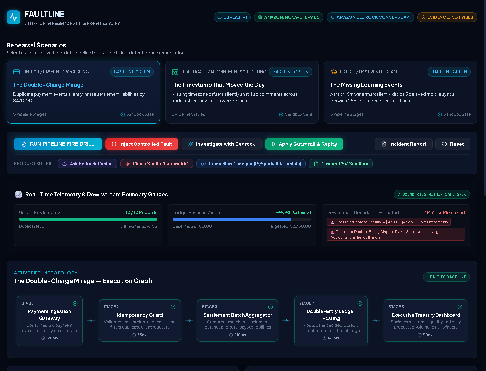
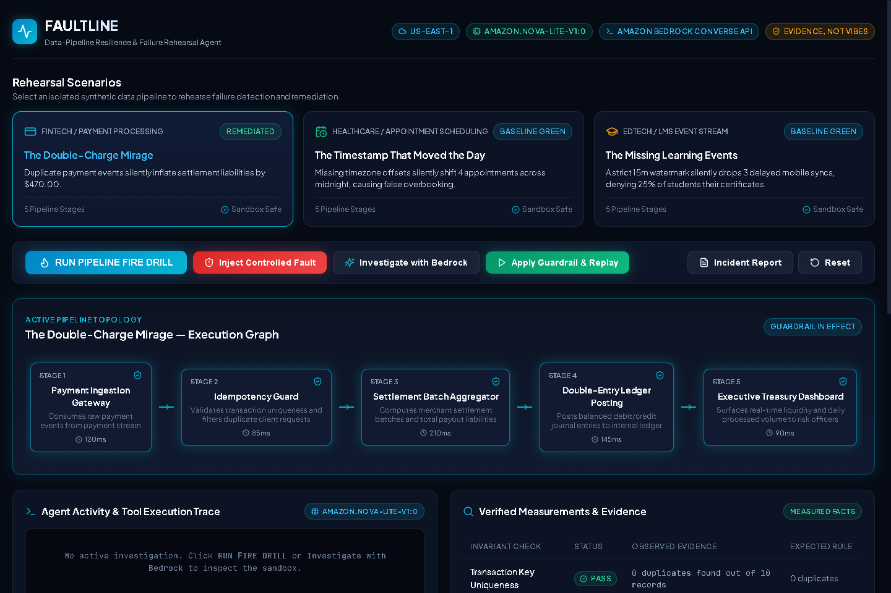

# FAULTLINE — Data-Pipeline Resilience & Failure Rehearsal Agent

[](https://opensource.org/licenses/MIT)
[](https://aws.amazon.com/bedrock/)
[](https://aws.amazon.com/lambda/)
[](tests/)
[](http://faultline-app-237657481511-us-east-1.s3-website-us-east-1.amazonaws.com)

> *"Your pipeline is green. But is your data telling the truth?"*  
> **Core Operating Principle:** **EVIDENCE, NOT VIBES.**

---

## 🌐 Live Deployed Application & Links

* **Live Frontend Web App (Amazon S3):**  
  👉 **[http://faultline-app-237657481511-us-east-1.s3-website-us-east-1.amazonaws.com](http://faultline-app-237657481511-us-east-1.s3-website-us-east-1.amazonaws.com)**

* **Live Backend API (Amazon API Gateway HTTP API):**  
  `https://82ixszzwmd.execute-api.us-east-1.amazonaws.com`

* **Official Challenge Entry:**  
  Built for the **AWS Builder Center Weekend Challenge: "Build an agent people actually enjoy using"**.

* **Target GitHub Repository:**  
  [https://github.com/mindofyaseen/faultline-agent](https://github.com/mindofyaseen/faultline-agent)

---

## 📸 The Enterprise Product Dashboard

FAULTLINE delivers an engineering workbench aesthetic that transforms abstract data quality issues into a tactile, guided resilience rehearsal platform:



*Figure 1: The FAULTLINE Enterprise Dashboard showcasing Live Telemetry & Boundary Gauges, Rehearsal Scenarios, Product Suites (Copilot, Chaos Studio, Codegen, CSV Sandbox), and Pipeline Execution Topologies.*



*Figure 2: Verifiable Before-vs-After Replay verification with cyan glow topology indicating guardrail in effect and 100% assertions passed.*

---

## 💎 Enterprise Product Capabilities

FAULTLINE goes beyond a standard hackathon prototype by providing a complete resilience product:

1. **🤖 Amazon Bedrock AI Copilot:** Interactive conversational assistant querying live sandbox state using `amazon.nova-lite-v1:0` with deterministic evidence citations.
2. **⚡ Parametric Chaos Studio:** Interactive parameter tuners allowing engineers to stress-test pipelines with variable duplicate counts, timezone drifts, and watermark latency skews.
3. **📜 Production Guardrail Codegen:** 1-click code export generating production-ready implementations for **AWS Glue / PySpark**, **dbt (SQL & tests)**, and **AWS Lambda (Python 3.12)**.
4. **📊 Custom Dataset Sandbox Profiler:** Sandbox profiling engine allowing data teams to paste raw CSV data to check primary key uniqueness, nulls, and schema drift.
5. **📈 Real-Time Boundary & Telemetry Gauges:** Visual progress bars displaying financial variances, clinic bed capacity thresholds, and SLA completion rates.

---

## 💡 What is FAULTLINE?

A data pipeline can finish with exit code 0 while producing completely distorted business metrics. Duplicate transactions, temporal timezone drifts, late-arriving mobile syncs, and subtle schema evolution silently corrupt downstream data warehouses and executive dashboards without throwing a single infrastructure error.

**FAULTLINE** is an evidence-first AI agent powered by **Amazon Bedrock (`amazon.nova-lite-v1:0`)** that allows engineering teams to safely rehearse, investigate, and remediate pipeline failures in an isolated sandbox before those failures affect production decisions.

### Why "Evidence, Not Vibes"?
Generic conversational assistants speculate about possible root causes. FAULTLINE executes deterministic Python inspection tools, calculates exact mathematical metrics, bounds citations to measured facts, and replays synthetic pipelines to prove that proposed guardrails actually work.

---

## 🧪 Three Reproducible Scenarios

| Scenario | Domain | Injected Failure | Discrepancy & Measured Impact | Remediation Guardrail |
|---|---|---|---|---|
| **The Double-Charge Mirage** | Fintech / Payments | Duplicate payment authorization events from network retries | Raw 13 records vs 10 unique; settlement ledger inflated by **+$470.00 (+32.98% overstatement)** | `idempotent_dedupe_on_key` |
| **The Timestamp That Moved the Day** | Healthcare / Scheduling | Omitted ISO-8601 UTC offsets causing midnight date rollover | 4 appointments jump from Oct 10 to Oct 11; Oct 11 volume surges to **18 (>16 capacity ceiling)** | `strict_utc_normalization_and_quarantine` |
| **The Missing Learning Events** | EdTech / Event Streams | 45m mobile sync delays exceed 15m watermark + field drift `completed_at` | Completion rate drops from **100% (12/12) to 75% (9/12)**; 3 students denied certificates | `adaptive_watermark_with_schema_aliasing` |

---

## 🏛️ Architecture Overview

FAULTLINE utilizes a serverless, cost-conscious, highly available AWS architecture:

```
[Browser Client]
       │
       ▼ (HTTPS)
[Amazon S3 Static Hosting] (React 18 + Vite + TypeScript)
       │
       ▼ (HTTPS REST /api)
[Amazon API Gateway HTTP API] (Low-latency endpoint)
       │
       ▼ (ASGI via Mangum)
[AWS Lambda Function] (Python 3.12 Runtime, 512 MB)
  ├── 8 Deterministic Analysis Tools
  └── Bedrock Converse API Agent Loop
       │
       ▼ (Converse API / ToolConfig)
[Amazon Bedrock] (amazon.nova-lite-v1:0 Foundation Model)
```

---

## 🛠️ The 8 Deterministic Tools

1. `inspect_pipeline`: Inspects stage topologies, runtime dependencies, and declared invariants.
2. `run_quality_profile`: Deterministically computes record counts, uniqueness, duplicates, nulls, and invariant evaluations.
3. `run_fault_scenario`: Injects approved, controlled faults into isolated synthetic fixtures.
4. `inspect_evidence`: Retrieves bounded record-level citations (exact IDs, timestamps, values).
5. `simulate_downstream_impact`: Quantifies financial and operational variances using declared business rules.
6. `propose_guardrail`: Resolves root causes to approved remediations from a validated catalog.
7. `replay_and_verify`: Re-executes the pipeline with the guardrail applied and computes assertion differentials.
8. `export_incident_report`: Generates structured Markdown and JSON incident rehearsal reports.

---

## 🚀 Quickstart & Local Development

### Prerequisites
* Python 3.12+
* Node.js 20+ & npm
* AWS CLI authenticated with credentials capable of invoking Amazon Bedrock (`us-east-1`)

### 1. Backend Setup
```bash
# Clone the repository
git clone https://github.com/mindofyaseen/faultline-agent.git
cd faultline-agent

# Create virtual environment and install dependencies
python -m venv .venv
.\.venv\Scripts\Activate.ps1   # (Windows) or source .venv/bin/activate (Linux/Mac)
pip install -r backend/requirements.txt

# Start backend server
uvicorn backend.main:app --reload --port 8000
```

### 2. Frontend Setup
```bash
cd frontend
npm install
npm run dev
# Open http://localhost:3000
```

### 3. Run Automated Test Suite
```bash
# From workspace root
pytest -v tests/
```

---

## ☁️ AWS Deployment Instructions

The repository includes fully automated deployment scripts:

```powershell
# Deploy serverless stack to AWS (Lambda + API Gateway + S3 Static Hosting)
powershell -ExecutionPolicy Bypass -File scripts\deploy_aws.ps1
```

The script autonomously:
1. Provisions IAM Role `faultline-lambda-role` with least-privilege Bedrock invocation permissions.
2. Packages the Python backend with Linux `manylinux2014_x86_64` binary wheels (`faultline-backend.zip`).
3. Deploys and updates the AWS Lambda function `faultline-backend-api`.
4. Creates the Amazon API Gateway HTTP API and configures public CORS.
5. Builds the production React frontend bundle with the live API Gateway URL.
6. Provisions Amazon S3 bucket `faultline-app-237657481511-us-east-1` for Static Web Hosting and syncs assets.

---

## 🔒 Security & Safety Boundaries

* **No Production Access:** Operates strictly on synthetic, isolated fixtures. Never touches production databases or live customer infrastructure.
* **No Arbitrary Execution:** Model cannot execute arbitrary SQL, shell, or bash commands.
* **Least-Privilege IAM:** IAM role is restricted solely to `bedrock:InvokeModel` and CloudWatch logging.
* **No PII/PHI:** 100% synthetic data. No real patient names, credit card numbers, or credentials.

---

## 💰 Cost Analysis

* **Compute (Lambda):** 100% Free Tier eligible (under 1M free monthly requests).
* **Storage (S3):** Frontend bundle is < 5 MB (Free Tier eligible).
* **API Gateway:** Under 1M free requests.
* **Amazon Bedrock Inference (`amazon.nova-lite-v1:0`):**
  - ~$0.00006 per 1,000 input tokens.
  - Typical Fire Drill Rehearsal (5 tool turns): **~$0.00040 USD** (less than 1/20th of a cent).
  - 100 complete rehearsals = **~$0.04 USD**.

---

## 🧹 Teardown & Resource Cleanup

To permanently delete all deployed AWS resources:

```bash
aws apigatewayv2 delete-api --api-id 82ixszzwmd --region us-east-1
aws lambda delete-function --function-name faultline-backend-api --region us-east-1
aws s3 rm s3://faultline-app-237657481511-us-east-1 --recursive --region us-east-1
aws s3 rb s3://faultline-app-237657481511-us-east-1 --region us-east-1
aws iam delete-role-policy --role-name faultline-lambda-role --policy-name FaultlineBedrockAccess
aws iam detach-role-policy --role-name faultline-lambda-role --policy-arn arn:aws:iam::aws:policy/service-role/AWSLambdaBasicExecutionRole
aws iam delete-role --role-name faultline-lambda-role
```

---

## 📄 License

This project is licensed under the [MIT License](LICENSE).
